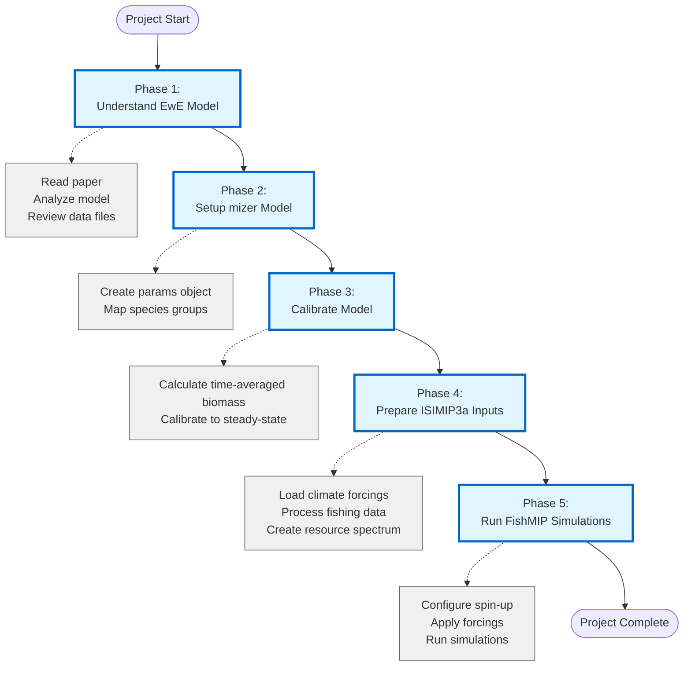

# AI‑Assisted Marine Ecosystem Modelling — Participant README

This README provides a single, cohesive guide for contributing to the AI‑assisted marine ecosystem modelling experiment. It blends the study protocol, modelling requirements, and AI usage guidelines into one workflow so you can get started quickly and submit consistently formatted results.

---

## 1) Purpose & Scope

We are testing how AI tools can support typical marine ecosystem modelling workflows—**model development, translation between frameworks, and simulation/diagnostics**—and whether AI assistance can produce **reliable, comparable outputs** across model types.

You may either:
- **Translate an existing model** (e.g., the *Dahood Southern Ocean model with sea ice*) into a different framework (preferred), **or**
- **Develop/translate a model for a region of your choice** using the same inputs/diagnostics standards (if you would not otherwise participate).

**Time commitment:** up to **20 self‑monitored hours**.  
– If you finish early, report your time.  
– If you reach 20 hours without finishing, submit what you have.

**Timeline:**  
- **Start:** September 30
- **Submission:** January 30, 2026

**AI access:** We will provide API keys for public AI tools (initial limit ~AUD 150 or USD equivalent). You can request more credit if needed.

---

## 2) Participation Overview

You will:
1. **Download** the provided input files and context for an Ecopath with EcoSim model in the Southern Occean (Dahood et al. 2019).
2. **Develop** a mizer model based on the same data and study.
3. Run analogous **simulations** to those implemented in Dahood et al. using FishMIP/ISIMIP3a conventions.  
4. Produce **diagnostics** (validation plots, skill metrics) as described in the accompanying pdf.
5. **Document** your use of AI (tools, tasks, performance, limitations).  
6. **Submit** and **Survey** via an anonymous (10-15 minute) survey, which includes an upload link.
7. **Review** another submission for quality and effectiveness.
---

Steps 1-6 are expected to take **no longer** than 20 active hours of work between now and February 28, 2026. Step 7 is expected to take less than 4 hours and will occur sometime in March 2026.

## 3) Accepted Model Frameworks

We would recommend that you use **mizer** as the target modelling framework (even if you may be unfamiliar with it). 

If you would much prefer to use another framework, please contact scott.spillias@csiro.au and kieran.murphy@utas.edu.au to discuss.

---

## 4) Repository & Folder Structure

Organise your contribution as follows (one folder per region/model):

```
/YourRegionName/
│
├── /Inputs/
│   ├── Environmental drivers (ISIMIP3a format)
│   ├── Species/functional group data
│   └── Fishing effort data
│
├── /Models/
│   ├── Human-developed/
│   └── AI-assisted/
│
├── /Diagnostics/
│   └── Validation plots, skill metrics
│
└── /Documentation/
    └── Model description, assumptions, notes
```

---

## 6) AI Usage — Principles & Good Practice

You may use:
## **IDE Plugins & AI Coding Assistants**
`GitHub Copilot, Sourcegraph Cody, Cursor, Windsurf (formerly Codeium), Roo Code, JetBrains AI Assistant, Codeium, Tabnine, Amazon CodeWhisperer, AskCodi, Blackbox AI, Visual Copilot, Qodo, DeepSeek Coder, CodeGeeX, TabbyML, FauxPilot, Continue.dev, Augment, Cline, Pieces`

---

## **Standalone AI IDEs**  
`Cursor, Windsurf, Zed, Replit Ghostwriter, Codium, CodeStory`

---

## **General AI Chatbots for Coding and Web Search**  
`ChatGPT (OpenAI), Claude (Anthropic), Gemini (Google), Microsoft Copilot, Perplexity AI, Grok`

---

## **Specialized / Emerging Tools**  
`Claude Code, OpenAI Codex, Mutable.ai, Refact.ai, StarCoder, Devin AI, Phind, Sourcery, AI Commits`

## Anything else!

**Good practice**
- Do your best to review and validate **AI‑generated code, text, and figures**. Part of the aim of this study is to evaluate how well these tools work when used by researchers with a range of domain and modelling expertise.
- Keep **brief notes or logs of impactful prompts/responses**.

**Data privacy**
- All of the data we are using in this study is fine to use in conjunction with any AI tools.
- For your own use-cases, do **not** paste into public AI tools: unpublished, confidential/proprietary, sensitive ecological/stakeholder data, or any non‑public content from primary sources.  
- When unsure, **ask a facilitator** or keep data local.

---

## 7) Documenting AI Performance (What to Record)

In your submission survey, you will be asked to include your reflections on how well the AI tools you used worked. Please keep track of:

- **Tools used** (which, and for what tasks)  
- **Effectiveness per task** (e.g., Likert scale or short rating)  
- **Where AI excelled / failed**  
- **Where you had to step in**  
- **Any refusals or safety blocks** that affected progress

(If feasible, attach relevant **chat logs** or excerpts.)

---

## 8) Validation & Benchmarking

- Use the provided **diagnostic plot templates** to validate model outputs.  
- Quantitative evaluation will follow the **FishMIP model skill procedure** to compare across models and regions.  
- Participants will **peer‑review** one or two other submissions for qualitative checks (e.g., “Does it pass the smell test?”).

Place validation artefacts (plots, metrics, notes) under:  
`/YourRegionName/Diagnostics/`

---


## 10) Submission Instructions 

**Placed all of the following into a zip file and upload them via the survey link below:**
- Model files (execution‑ready)
- Outputs as **CSV** (time‑series)
- **Diagnostics** (validation plots, skill metrics)
- **AI usage appendix** and (if possible) **chat histories**

During the survey you will be prompted to include a short description of your approach, assumptions, and any notes on AI usage. 

---

## 11) Survey

Please complete the post‑project survey: **[\[Survey Link\]](https://csiro.qualtrics.com/jfe/form/SV_6opBbEzhMbvLHOC)**

---


## 12) Workflow Overview



## Key Resources Provided in Project Directory

### 📄 **Data Files**
- `EwE_files/` - EwE model data from Dahood et al. 2020
  - `Dahood WAP -Basic input.csv` - Base model parameters
  - `Dahood WAP -Diet composition.csv` - Diet matrix
  - `Dahood WAP -Time series grid.csv` - Observed biomass time series
  - `Dahood WAP -Forcing functions grid.csv` - Environmental forcings
  - `Dahood WAP -Fishing effort functions grid.csv` - Fishing effort data
  - `Dahood WAP -Fishing mortality functions grid.csv` - Fishing mortality data

### 🌊 **ISIMIP3a Climate Forcing Inputs** (1961-2010, monthly, 15 arcmin resolution)
- `ISIMIP3a_climate_forcing_inputs/`
  - **Required forcing:**
    - `temperature_forcing/` - Sea surface temperature (tos) and bottom temperature (tob)
    - `plankton_forcing/` - Phytoplankton (diatoms, diazotrophs, picophytoplankton) and Zooplankton (mesozooplankton, microzooplankton)
  - **Optional forcing:**
    - `optional_additional_forcing/Sea_ice_forcing/` - Sea ice concentration (siconc) for advanced exploration

### 🎣 **ISIMIP3a Fishing Forcing Inputs**
- `ISIMIP3a_fishing_forcing_inputs/` - Historical fishing effort (1841-2017)
  - `effort_histsoc_1841_2017_western-antarctic-peninsula.parquet`
  - `effort_dictionary.parquet` - Metadata for fishing effort data
- **EwE Model Fishing Fleets**:
  - Krill fishery (Antarctic krill)
  - *N. rossii* fishery (marbled rockcod)
  - *C. gunnari* fishery (mackerel icefish)

### 📊 **ISIMIP3a Calibration Data**
- `ISIMIP3a_calibration_data/` - Catch data for calibration (1850-2017)
  - `calibration_catch_histsoc_1850_2017_western-antarctic-peninsula.parquet`
  - `catch_dictionary.parquet` - Metadata for catch data


### 🔗 **External Resources**
- **Dahood et al. 2020 Paper**: https://doi.org/10.1016/j.biocon.2020.108766
- **mizer Course**: https://mizer.course.sizespectrum.org/
- **FishMIP 2.0 ISIMIP3a Protocol**: https://github.com/Fish-MIP/FishMIP2.0_ISIMIP3a
- **Ortega-Cisneros et al. 2025 - Fishing Effort Mapping**: https://agupubs.onlinelibrary.wiley.com/doi/10.1029/2024EF004826 (See Section 2.2 Step 5)
- **FishMIP Input Explorer**: https://rstudio.global-ecosystem-model.cloud.edu.au/shiny/FishMIP_Input_Explorer/

## Workflow Summary

1. **Phase 1**: Understand the Western Antarctic Peninsula EwE model structure and data
2. **Phase 2**: Initialize mizer params object using EwE model as template
3. **Phase 3**: Calibrate steady-state model using time-averaged biomass
4. **Phase 4**: Prepare climate forcings and fishing inputs following ISIMIP3a standards
5. **Phase 5**: Execute FishMIP protocol with model spin-up and historical simulations

---

**Note**: This workflow integrates AI-assisted coding throughout all phases. Participants should leverage LLM coding agents to navigate data processing, model calibration, and protocol implementation steps.

## 13) Contacts & Support

Questions about modelling or AI tool usage? Get in touch:
- **scott.spillias@csiro.au**
- **kieran.murphy@utas.edu.au**

---
